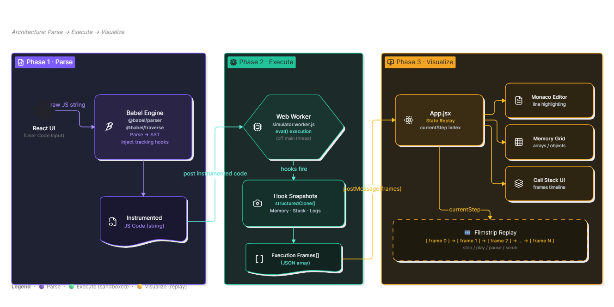

<div align="center">

# LogicLens

### Interactive JavaScript Code Execution Visualizer

<p align="center">
Visualize JavaScript execution step-by-step using AST instrumentation, sandboxed execution, and interactive state replay.
</p>

<p align="center">


</p>

---

## 🎬 Live Demo

### Link : [logic-lens](https://logic-lens-sigma.vercel.app/)

---

</div>

# Overview

An interactive code execution visualizer built with **React, Vite, Monaco Editor, Babel, and Web Workers**. LogicLens allows users to write or load JavaScript code, simulate it step by step, and visually inspect how variables, arrays, objects, console output, and execution flow change over time.

LogicLens is designed for students, algorithm learners, and developers who want to understand what happens inside a program while it runs instead of only seeing the final output.

- 📌 Current executing line
- 🧠 Memory state
- 📚 Call Stack
- 🖥 Console Output
- 🔄 Variable updates
- 🎞 Frame-by-frame execution

The entire execution pipeline is built using **AST instrumentation**, **Web Workers**, and **React state replay**, making execution safe, responsive, and highly interactive.

---

# Features

- **Interactive JavaScript Editor** - write and edit code using Monaco Editor, the same editor engine used by VS Code
- **Step-by-Step Execution Timeline** - simulate code and move through execution frames manually or automatically
- **AST-Based Code Instrumentation** - uses Babel to parse JavaScript and inject tracing hooks into the code
- **Memory Visualizer** - displays variables, primitive values, arrays, and objects as they change during execution
- **Array Index Highlighting** - automatically highlights active indices using common pointer variables such as `i`, `j`, `mid`, `left`, `right`, and `minIdx`
- **Line Highlighting** - highlights the currently executing source-code line inside the editor
- **Console Output Tracking** - captures `console.log()` output and syncs it with the execution timeline
- **Playback Controls** - includes simulate, reset, step forward, step backward, play/pause, and speed control
- **Web Worker Execution** - runs instrumented code in a separate browser thread to keep the UI responsive
- **Algorithm Snippet Library** - includes ready-made examples for loops, recursion, sorting, searching, and linked lists
- **Error Frame Handling** - captures runtime errors and displays the latest available execution state when possible

---

## System Architecture



---

#  Execution Pipeline

```
                User JavaScript
                       │
                       ▼
         Babel Parser (@babel/parser)
                       │
                       ▼
             Abstract Syntax Tree
                       │
                       ▼
        Babel Traverse (@babel/traverse)
                       │
          Inject Tracking Hooks
                       │
                       ▼
          Instrumented JavaScript
                       │
                       ▼
        Web Worker (Sandboxed Thread)
                       │
                       ▼
              eval(instrumentedCode)
                       │
          Tracking Hooks Execute
                       │
                       ▼
       Memory + Stack + Logs Snapshot
                       │
                       ▼
      Array of Execution Frames (JSON)
                       │
                       ▼
             React Replay Engine
                       │
          currentStep State Index
                       │
      ┌──────────┬───────────┬───────────┐
      ▼          ▼           ▼
 Monaco      Memory Grid   Call Stack
```

---

#  Architecture Breakdown

## Phase 1 — Parse & Instrument

**File**

```
src/engine/instrument.js
```

### Responsibilities

- Parse raw JavaScript
- Generate AST
- Traverse syntax tree
- Inject tracking hooks
- Preserve original semantics

### Technologies

- @babel/parser
- @babel/traverse
- @babel/generator

### Output

```
Instrumented JavaScript
```

---

## Phase 2 — Sandboxed Execution

**File**

```
src/simulator.worker.js
```

The instrumented code is executed inside a **Web Worker**.

Using a separate thread ensures:

- UI never freezes
- Infinite loops don't block rendering
- Safe execution environment

During execution, every tracking hook records:

- Memory
- Variables
- Arrays
- Objects
- Call Stack
- Console Logs

Each snapshot is deep-cloned using

```
structuredClone()
```

to guarantee immutable execution frames.

### Output

```
ExecutionFrames[]
```

---

## Phase 3 — State Replay

**File**

```
src/App.jsx
```

The worker returns

```
ExecutionFrames[]
```

React simply changes

```
currentStep
```

Every UI component automatically updates.

```
ExecutionFrames[currentStep]
```

drives

- Monaco Editor
- Memory Grid
- Call Stack
- Console Panel

This creates a smooth film-strip style debugging experience.

---
# Project Structure

```text
LogicLens/
|-- public/
|   |-- favicon.svg              -> Browser favicon
|   `-- icons.svg                -> Public icon assets
|-- src/
|   |-- assets/
|   |   |-- hero.png             -> README / project preview image
|   |   |-- react.svg            -> React asset
|   |   `-- vite.svg             -> Vite asset
|   |-- engine/
|   |   `-- instrument.js        -> Babel parser + AST instrumentation engine
|   |-- App.jsx                  -> Main React app, editor, controls, visualizer UI
|   |-- App.css                  -> App layout, panels, memory cards, array styling
|   |-- index.css                -> Global styles, fonts, scrollbars, stack styling
|   |-- main.jsx                 -> React entry point
|   |-- simulator.worker.js      -> Web Worker runtime for executing instrumented code
|   `-- snippets.js              -> Built-in algorithm examples
|-- .gitignore
|-- eslint.config.js             -> ESLint configuration
|-- index.html                   -> Vite HTML entry file
|-- package.json                 -> Scripts and dependencies
|-- package-lock.json
|-- README.md
`-- vite.config.js               -> Vite configuration
```

| File | Role |
|------|------|
| `src/App.jsx` | Main application component. Manages code state, simulation frames, Monaco Editor, controls, and visualizer panels |
| `src/engine/instrument.js` | Converts JavaScript source code into an instrumented version using Babel AST transforms |
| `src/simulator.worker.js` | Executes instrumented code in a Web Worker and records memory, stack, console, and line frames |
| `src/snippets.js` | Stores built-in example programs such as sorting, searching, recursion, and linked list traversal |
| `src/App.css` | Styles the main interface, editor pane, memory grid, console, controls, and animations |
| `src/index.css` | Defines global page styling, fonts, scrollbar styling, and call-stack card styles |
| `src/main.jsx` | Mounts the React application into the browser DOM |
| `package.json` | Defines project dependencies and npm commands such as `dev`, `build`, `lint`, and `preview` |

---

#  Tech Stack

| Technology | Purpose |
|------------|----------|
| React | User Interface |
| Vite | Development Server |
| JavaScript | Application Logic |
| Babel Parser | AST Generation |
| Babel Traverse | Code Instrumentation |
| Web Workers | Sandboxed Execution |
| Monaco Editor | Code Editing |
| structuredClone() | Immutable Snapshots |

---

# Getting Started

## Clone Repository

```bash
git clone https://github.com/Vedant-Divate/LogicLens.git
```

```
cd LogicLens
```

---

## Install Dependencies

```bash
npm install
```

---

## Start Development Server

```bash
npm run dev
```

---

Open

```
http://localhost:5173
```

---

# How It Works

Suppose the user enters

```javascript
let a = 5;
let b = 10;
let sum = a + b;

console.log(sum);
```

LogicLens performs the following:

```
User Code
      │
      ▼
AST Parsing
      │
      ▼
Instrumentation
      │
      ▼
Sandbox Execution
      │
      ▼
Snapshot Generation
      │
      ▼
Replay Timeline
      │
      ▼
Visual Components
```

Instead of only displaying

```
15
```

LogicLens records every intermediate state, allowing users to inspect exactly how execution progresses.

---

# UI Components

| Component | Description |
|------------|-------------|
| Monaco Editor | Displays source code with active line highlighting |
| Memory Grid | Visualizes variables, arrays, and objects |
| Call Stack | Shows active execution frames |
| Console Panel | Displays console output |
| Timeline Controller | Navigate execution frame-by-frame |

---

# Future Enhancements

- TypeScript support
- Python execution visualization
- Breakpoints
- Reverse debugging
- AI-generated execution explanations
- Expression evaluation
- Execution graph visualization
- Collaborative sessions
- Export execution timeline
- Theme customization


---

# License

This project is licensed under the **MIT License**.

---

<div align="center">

### ⭐ If you found LogicLens useful, consider giving the repository a star!

</div>